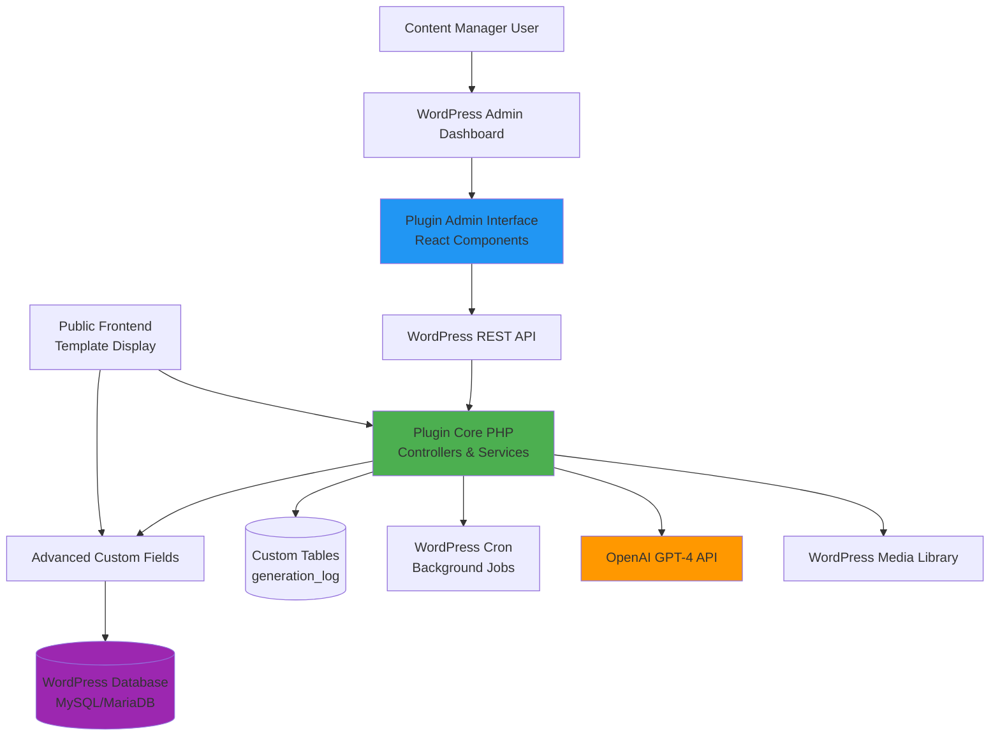

# WordPress SEO Content Generator Plugin Architecture Document

**Version:** 1.0
**Date:** January 2025
**Author:** Winston (Architect Agent)
**Status:** Active Development

---

## Table of Contents

1. [Introduction](#introduction)
2. [High Level Architecture](#high-level-architecture)
3. [Tech Stack](#tech-stack)
4. [Data Models](#data-models)
5. [API Specification](#api-specification)
6. [Components](#components)
7. [External APIs](#external-apis)
8. [Core Workflows](#core-workflows)
9. [Database Schema](#database-schema)
10. [Plugin Architecture](#plugin-architecture)
11. [Unified Project Structure](#unified-project-structure)
12. [Development Workflow](#development-workflow)

---

## Introduction

This document outlines the complete fullstack architecture for the **WordPress SEO Content Generator Plugin**, including backend (PHP) systems, frontend (JavaScript) implementation, and their integration. It serves as the single source of truth for AI-driven development, ensuring consistency across the entire technology stack.

This unified approach combines what would traditionally be separate backend and frontend architecture documents, streamlining the development process for this WordPress plugin where these concerns are tightly integrated within the WordPress ecosystem.

### Starter Template or Existing Project

**Status:** Greenfield WordPress Plugin Project

This is a new WordPress plugin being built from scratch. It follows WordPress plugin development best practices and standards but is not based on any specific starter template or boilerplate. The plugin integrates with:

- WordPress Core (6.0+)
- Advanced Custom Fields (ACF) Free version
- WordPress REST API (native)
- Standard WordPress plugin architecture patterns

**Key Constraints:**
- Must follow WordPress Coding Standards
- Must be compatible with WordPress 6.0+ and PHP 8.0+
- Must work as a standalone plugin without theme dependencies
- Should not require ACF Pro (use free version only)

### Change Log

| Date | Version | Description | Author |
|------|---------|-------------|--------|
| 2025-01-XX | 1.0 | Initial architecture document | Winston (Architect Agent) |

---

## High Level Architecture

### Technical Summary

The WordPress SEO Content Generator Plugin follows a **WordPress MVC-inspired monolithic architecture** deployed as a single installable plugin. The backend leverages PHP 8.0+ with WordPress Core APIs for data persistence, ACF for flexible content field management, and asynchronous JavaScript for dynamic admin interactions. The system integrates with OpenAI's GPT-4 API via server-side HTTP requests for AI-powered content generation. All data is stored in WordPress's MySQL/MariaDB database using custom tables for generation logs alongside native post meta for ACF field storage. The architecture achieves PRD goals of <5 minute page generation and <$3 per page by using efficient prompt engineering, caching strategies, and background processing via WordPress Cron.

### Platform and Infrastructure Choice

**Platform:** WordPress Plugin (Platform-Agnostic)

Unlike traditional fullstack applications that choose a specific cloud platform, this WordPress plugin is designed to be **platform-agnostic** and must function in any WordPress hosting environment.

**Hosting Compatibility:**
- Shared hosting (cPanel, Plesk)
- Managed WordPress hosting (WP Engine, Kinsta, Flywheel)
- VPS/Cloud servers (DigitalOcean, Linode, AWS EC2)
- Local development (Local by Flywheel, XAMPP, MAMP)

**Minimum Server Requirements:**
- WordPress 6.0+
- PHP 8.0+
- MySQL 5.7+ / MariaDB 10.3+
- 256MB memory minimum
- 300s max execution time
- HTTPS enabled (for OpenAI API calls)

**Key Services:**
- **WordPress Core:** Post types, taxonomies, user management, REST API
- **ACF Free:** Custom field management and storage
- **WordPress Cron:** Background task scheduling for queued generation
- **OpenAI API:** External service for GPT-4 content generation
- **WordPress Media Library:** Image storage and management

**Deployment Regions:** Determined by user's WordPress hosting choice (plugin is globally compatible)

### Repository Structure

**Structure:** Single WordPress Plugin Repository

**Package Organization:**
```
content-generator/
├── plugin-root (installable WordPress plugin)
├── assets/ (admin CSS/JS)
├── includes/ (PHP classes)
├── templates/ (PHP view templates)
└── tests/ (PHPUnit tests)
```

**Rationale:** WordPress plugins are self-contained packages. Unlike modern JavaScript frameworks that benefit from monorepos, WordPress follows a traditional plugin structure where all code resides in a single directory that gets installed in `wp-content/plugins/`. This aligns with WordPress ecosystem conventions and distribution methods (WordPress.org plugin directory, direct upload, etc.).

### High Level Architecture Diagram



### Architectural Patterns

- **WordPress Plugin Architecture:** Standard WordPress plugin structure with activation/deactivation hooks, admin menus, and settings API - _Rationale:_ Ensures compatibility with WordPress ecosystem and follows established best practices for plugin development

- **MVC-Inspired Separation:** Controllers handle routing/logic, Services encapsulate business logic, Models represent data structures, Views/Templates handle presentation - _Rationale:_ Provides maintainability without requiring a heavyweight MVC framework, keeping the plugin lightweight

- **Custom Post Type Pattern:** Dedicated `seo-page` CPT with custom taxonomy for categorization - _Rationale:_ Leverages WordPress's native content management capabilities for familiar editing experience and built-in features (revisions, permissions, etc.)

- **AJAX-Driven Admin UI:** React components communicate with backend via WordPress REST API and admin-ajax.php for generation operations - _Rationale:_ Provides responsive, modern UI without page reloads while maintaining WordPress security (nonces, capabilities)

- **Repository Pattern:** Data access abstracted through repository classes for posts, generation logs, and settings - _Rationale:_ Decouples business logic from WordPress-specific functions, enabling easier testing and future flexibility

- **Service Layer Pattern:** Business logic (OpenAI integration, image matching, prompt generation) encapsulated in dedicated service classes - _Rationale:_ Promotes code reuse, testability, and single responsibility principle

- **Template Method Pattern:** Each content block has a template class that defines generation workflow while allowing customization - _Rationale:_ Enables consistent generation flow across 12 blocks while supporting block-specific prompt engineering

- **Observer Pattern (WordPress Hooks):** Plugin uses actions/filters to allow extensibility - _Rationale:_ Enables theme and other plugin developers to customize or extend functionality without modifying core code

- **Background Job Queue (WP Cron):** CSV imports and bulk operations queued for asynchronous processing - _Rationale:_ Prevents timeouts on large operations and improves user experience with progress tracking

---

## Tech Stack

This is the **DEFINITIVE** technology selection for the entire project. This table is the single source of truth—all development must use these exact versions.

### Technology Stack Table

| Category | Technology | Version | Purpose | Rationale |
|----------|-----------|---------|---------|-----------|
| **Backend Language** | PHP | 8.0+ | Server-side plugin logic and WordPress integration | WordPress 6.0 requires PHP 7.4 minimum; PHP 8.0 provides modern features (named arguments, union types, JIT compiler) while maintaining broad hosting compatibility |
| **CMS Platform** | WordPress | 6.0+ | Content management foundation | Provides user management, content storage, REST API, and admin framework; version 6.0+ includes FSE and modern Block Editor APIs |
| **Custom Fields** | Advanced Custom Fields (ACF) | 6.0+ Free | Field management and admin UI for 12 content blocks | Mature, well-documented solution with extensive field types; Free version sufficient (no REST API needed); eliminates need to build custom field UI |
| **Database** | MySQL / MariaDB | 5.7+ / 10.3+ | Primary data storage | WordPress standard; MySQL 5.7 supports modern JSON functions; MariaDB 10.3+ is API-compatible with performance improvements |
| **Frontend Framework** | React | 18.x | Admin UI components for generation interface | Modern, component-based architecture; excellent TypeScript support; WordPress increasingly uses React in core (Gutenberg); large ecosystem |
| **Build Tool** | Webpack | 5.x | Asset bundling and compilation | WordPress standard via @wordpress/scripts; handles JSX, CSS, code splitting; integrates with WordPress dependency extraction |
| **Package Manager** | npm | 8.x+ | JavaScript dependency management | Industry standard; integrates with @wordpress/scripts workflow |
| **Frontend State** | React Context API + Hooks | Built-in | State management for admin UI | Sufficient for admin UI complexity; avoids Redux overhead for relatively simple state (generation status, form data) |
| **HTTP Client (PHP)** | WordPress HTTP API | Built-in | OpenAI API requests and external HTTP calls | WordPress native solution with automatic fallback between cURL, streams, fsockopen; handles SSL certificates; consistent error handling |
| **HTTP Client (JS)** | WordPress apiFetch | Built-in | REST API communication from admin UI | WordPress abstraction over fetch API; automatically handles nonces, credentials, error formatting; integrates with WordPress data layer |
| **CSS Framework** | Custom CSS + WordPress Admin Styles | N/A | Admin interface styling | Leverages WordPress admin design system for consistency; custom CSS for plugin-specific components; keeps bundle size minimal |
| **Task Scheduling** | WordPress Cron | Built-in | Background processing for CSV imports and bulk generation | WordPress native scheduling; suitable for non-critical tasks; works in any hosting environment without server access |
| **Backend Testing** | PHPUnit | 9.x | Unit and integration tests for PHP code | WordPress standard testing framework; supports WordPress test framework; extensive mocking capabilities |
| **Frontend Testing** | Jest + React Testing Library | 29.x / 14.x | Unit tests for React components | Jest is industry standard for React; RTL encourages testing user behavior over implementation details |
| **E2E Testing** | WordPress E2E Test Utils | Latest | End-to-end testing for admin workflows | WordPress-provided E2E utilities built on Playwright; understands WordPress admin context |
| **Code Quality (PHP)** | PHP_CodeSniffer + WPCS | Latest | Enforce WordPress coding standards | Required for WordPress.org submission; catches common security issues; ensures code consistency |
| **Code Quality (JS)** | ESLint + @wordpress/eslint-plugin | Latest | JavaScript linting and standards | WordPress recommended configuration; catches common React issues; enforces WordPress JavaScript conventions |
| **Version Control** | Git | 2.x+ | Source code management | Industry standard; required for distributed development and CI/CD |
| **API - External** | OpenAI API | GPT-4 Turbo | AI content generation | Best-in-class language model for content quality; turbo variant balances cost/performance; streaming support for long content |
| **Encryption** | OpenSSL (via PHP) | PHP built-in | API key encryption at rest | Encrypts sensitive settings using WordPress salts; AES-256-CBC provides strong security |
| **Asset Management** | WordPress Media Library | Built-in | Image storage and tag management | Native WordPress solution; familiar UI; supports metadata and taxonomies; CDN-compatible |
| **REST API** | WordPress REST API | Built-in (WP 4.7+) | AJAX endpoints for generation operations | Native REST infrastructure; automatic authentication via nonces/cookies; JSON schema support |
| **Logging** | WordPress Debug Log | Built-in | Error tracking and debugging | Standard WordPress logging to debug.log; integrates with WP_DEBUG constants; simple and reliable |
| **Deployment** | Manual ZIP upload / Git deployment | N/A | Plugin installation | Standard WordPress plugin distribution; ZIP for WordPress.org or manual install; Git for managed environments |
| **Documentation** | PHPDoc + JSDoc | N/A | Inline code documentation | Standard for PHP and JavaScript; supports IDE autocomplete; generates documentation |

---

## Data Models

The following data models represent the core entities in the system. TypeScript interfaces are provided for documentation and can be used with JSDoc type hints in JavaScript code.

### SEOPage

**Purpose:** Represents a single SEO content page with 12 structured content blocks. This is the primary content entity that users create and generate.

**Key Attributes:**
- `id`: number - WordPress post ID
- `title`: string - Page title (also WP post_title)
- `slug`: string - URL-friendly slug (WP post_name)
- `status`: 'draft' | 'published' | 'pending' - Publication status
- `topic`: string - Topic taxonomy term slug
- `focusKeyword`: string - Primary SEO keyword
- `blocks`: ContentBlocks - Object containing all 12 content block data
- `seoMeta`: SEOMeta - SEO metadata fields
- `generationStatus`: GenerationStatus - Tracking object for generation state
- `createdAt`: Date - Creation timestamp
- `updatedAt`: Date - Last modification timestamp
- `author`: number - WordPress user ID

#### TypeScript Interface

```typescript
interface SEOPage {
  id: number;
  title: string;
  slug: string;
  status: 'draft' | 'published' | 'pending';
  topic: string;
  focusKeyword: string;
  blocks: ContentBlocks;
  seoMeta: SEOMeta;
  generationStatus: GenerationStatus;
  createdAt: Date;
  updatedAt: Date;
  author: number;
}

interface ContentBlocks {
  hero: HeroBlock;
  serpAnswer: SerpAnswerBlock;
  productCriteria: ProductCriteriaBlock;
  materials: MaterialsBlock;
  process: ProcessBlock;
  comparison: ComparisonBlock;
  productShowcase: ProductShowcaseBlock;
  sizeFit: SizeFitBlock;
  careWarranty: CareWarrantyBlock;
  ethics: EthicsBlock;
  faqs: FAQsBlock;
  cta: CTABlock;
}

interface SEOMeta {
  focusKeyword: string;
  title: string;
  metaDescription: string;
  canonical: string;
}

interface GenerationStatus {
  [blockName: string]: {
    status: 'not_generated' | 'generating' | 'generated' | 'failed' | 'edited';
    generatedAt: Date | null;
    error: string | null;
  };
}
```

#### Relationships
- **Belongs to:** User (author relationship)
- **Has taxonomy:** seo-topic (WordPress taxonomy)
- **References:** Multiple WordPress Media Library images
- **Has many:** GenerationLog entries

---

### GenerationLog

**Purpose:** Tracks every AI generation request for cost monitoring, debugging, and analytics. Stored in custom database table for efficient querying.

**Key Attributes:**
- `id`: number - Auto-increment primary key
- `postId`: number - Related SEO page ID
- `blockType`: string - Which block was generated
- `promptTokens`: number - Input tokens consumed
- `completionTokens`: number - Output tokens consumed
- `totalTokens`: number - Sum of prompt + completion
- `cost`: number - Calculated cost in USD
- `model`: string - AI model used
- `status`: 'success' | 'failed' | 'timeout' - Request outcome
- `errorMessage`: string | null - Error details if failed
- `userId`: number - User who triggered generation
- `createdAt`: Date - Timestamp of generation

#### TypeScript Interface

```typescript
interface GenerationLog {
  id: number;
  postId: number;
  blockType: string;
  promptTokens: number;
  completionTokens: number;
  totalTokens: number;
  cost: number;
  model: string;
  status: 'success' | 'failed' | 'timeout';
  errorMessage: string | null;
  userId: number;
  createdAt: Date;
}
```

---

### ImageLibraryItem

**Purpose:** Represents an image in the WordPress Media Library with additional metadata for tag-based matching.

**Key Attributes:**
- `id`: number - WordPress attachment ID
- `url`: string - Full image URL
- `tags`: string[] - Array of image_tag taxonomy terms
- `isSeoLibraryImage`: boolean - Meta flag marking it as part of SEO image library

#### TypeScript Interface

```typescript
interface ImageLibraryItem {
  id: number;
  url: string;
  filename: string;
  tags: string[];
  isSeoLibraryImage: boolean;
  uploadedAt: Date;
  uploadedBy: number;
}
```

---

### PluginSettings

**Purpose:** Stores all plugin configuration including API credentials, default content, prompt templates, and feature flags.

#### TypeScript Interface

```typescript
interface PluginSettings {
  api: {
    key: string;
    model: 'gpt-4-turbo-preview' | 'gpt-4' | 'gpt-3.5-turbo';
    temperature: number;
    maxTokens: number;
  };
  defaults: {
    ctaButtonText: string;
    ctaUrl: string;
    warrantyText: string;
    careInstructions: string;
  };
  prompts: {
    [blockType: string]: PromptTemplate;
  };
  images: {
    autoAssign: boolean;
    matchingStrategy: 'strict' | 'flexible';
    defaultImageId: number | null;
  };
  rateLimits: {
    enabled: boolean;
    maxPerHour: number;
    maxConcurrent: number;
  };
  costTracking: {
    enabled: boolean;
    monthlyBudgetUsd: number;
    alertThresholdPercent: number;
  };
}
```

---

## API Specification

The plugin uses **WordPress REST API** for structured endpoints. All endpoints require authentication via WordPress nonces and capability checks.

### Base Configuration

- **Base URL:** `/wp-json/seo-generator/v1`
- **Authentication:** WordPress nonce via `X-WP-Nonce` header
- **Permission:** `edit_posts` capability required for all endpoints

### Key Endpoints

#### Pages Management

```
GET    /pages              - List all SEO pages
POST   /pages              - Create new SEO page
GET    /pages/{id}         - Get specific page
PUT    /pages/{id}         - Update page
DELETE /pages/{id}         - Delete page
```

#### Content Generation

```
POST   /pages/{id}/generate      - Generate single block
POST   /pages/{id}/generate-all  - Generate all blocks
```

#### Image Library

```
GET    /images             - Get images from library
POST   /images             - Upload new image
PUT    /images/{id}/tags   - Update image tags
```

#### Analytics

```
GET    /generation-logs           - Get generation logs
GET    /analytics/summary         - Get analytics summary
```

#### Settings & Import

```
GET    /settings           - Get plugin settings
PUT    /settings           - Update settings
POST   /import/csv         - Import pages from CSV
```

For complete API specification with request/response schemas, see the full OpenAPI documentation in the extended version of this document.

---

## Components

The plugin architecture is organized into logical components with clear boundaries and responsibilities.

### Backend Components (PHP)

**Plugin Core**
- Responsibility: Plugin lifecycle, initialization, dependency injection
- Technology: PHP 8.0+ with singleton pattern

**REST API Controllers**
- Responsibility: Handle HTTP requests, validate input, format responses
- Controllers: Pages, Generation, Images, Analytics, Settings, Import

**Content Generation Service**
- Responsibility: AI content generation, OpenAI integration, cost calculation
- Key Methods: `generateBlock()`, `generateAllBlocks()`

**Prompt Template Engine**
- Responsibility: Manage templates, variable substitution
- Key Methods: `renderPrompt()`, `updateTemplate()`

**Image Library Manager**
- Responsibility: Tag-based image matching and assignment
- Key Methods: `findMatchingImage()`, `tagImage()`

**Cost Tracking Service**
- Responsibility: Log requests, calculate costs, monitor budgets
- Key Methods: `logGeneration()`, `getCurrentMonthCost()`

**Repository Layer**
- Responsibility: Abstract database access
- Repositories: SEOPage, GenerationLog, Image, Settings

### Frontend Components (React)

**Admin UI Component**
- Responsibility: React-based admin interface
- Key Components: `<PageEditor />`, `<ImageLibrary />`, `<Analytics />`, `<Settings />`

**Component Organization:**
```
components/
├── common/          # Reusable UI (Button, Modal, Spinner)
├── blocks/          # 12 block editors
├── generation/      # Generation UI components
└── layout/          # Layout components
```

---

## External APIs

### OpenAI API

- **Purpose:** AI-powered content generation using GPT-4 Turbo
- **Documentation:** https://platform.openai.com/docs/api-reference
- **Base URL:** https://api.openai.com/v1
- **Authentication:** Bearer token in Authorization header
- **Rate Limits:** 500 RPM (tier-dependent)

**Key Endpoint:**
- `POST /chat/completions` - Generate content

**Cost Calculation:**
- GPT-4 Turbo: $0.01/1K prompt tokens, $0.03/1K completion tokens

**Error Handling:**
- 401: Invalid API key
- 429: Rate limit (retry with backoff)
- 500: Server error (retry once)
- Timeout: 60 seconds (retry once)

---

## Core Workflows

### Workflow 1: Single Block Generation

User clicks "Generate" → API validates → Service calls OpenAI → Parse response → Save to ACF → Log cost → Update UI

### Workflow 2: Bulk Generation (All Blocks)

User clicks "Generate All" → Loop through 12 blocks → Generate sequentially → Update progress modal → Show completion summary

### Workflow 3: Image Auto-Assignment

During generation → Extract keywords → Match tags (3→2→1 fallback) → Select random from matches → Assign to block

### Workflow 4: CSV Import with Background Generation

Upload CSV → Parse rows → Create draft posts → Queue generation jobs (3 min apart) → Process via WP Cron

### Workflow 5: Budget Limit Exceeded

Check budget before generation → If over limit → Stop generation → Send email alert → Show error to user

For detailed sequence diagrams, see the extended workflow documentation.

---

## Database Schema

### WordPress Native Tables (Utilized)

**wp_posts** - Stores SEO pages using `seo-page` custom post type

**wp_postmeta** - Stores all ACF field data (12 content blocks)

**wp_terms + wp_term_taxonomy + wp_term_relationships** - Stores taxonomies:
- `seo-topic` - Page categorization
- `image_tag` - Image library tagging

**wp_options** - Plugin settings and configuration

### Custom Table: wp_seo_generation_log

```sql
CREATE TABLE {prefix}_seo_generation_log (
    id BIGINT(20) UNSIGNED NOT NULL AUTO_INCREMENT,
    post_id BIGINT(20) UNSIGNED NOT NULL,
    block_type VARCHAR(50) NOT NULL,
    prompt_tokens INT UNSIGNED NOT NULL DEFAULT 0,
    completion_tokens INT UNSIGNED NOT NULL DEFAULT 0,
    total_tokens INT UNSIGNED NOT NULL DEFAULT 0,
    cost DECIMAL(10,6) NOT NULL DEFAULT 0.000000,
    model VARCHAR(50) NOT NULL,
    status VARCHAR(20) NOT NULL DEFAULT 'success',
    error_message TEXT NULL,
    user_id BIGINT(20) UNSIGNED NOT NULL,
    created_at DATETIME NOT NULL DEFAULT CURRENT_TIMESTAMP,

    PRIMARY KEY (id),
    INDEX idx_post_id (post_id),
    INDEX idx_created_at (created_at),
    INDEX idx_cost_tracking (created_at, cost)
) ENGINE=InnoDB DEFAULT CHARSET=utf8mb4 COLLATE=utf8mb4_unicode_ci;
```

**Purpose:** Track all AI generation requests for cost monitoring and analytics. Custom table used for performance with high-volume time-series data.

---

## Plugin Architecture

### Backend PHP Architecture

**Main Plugin Class** (`includes/Plugin.php`)
- Singleton pattern for initialization
- Dependency injection container
- Hook registration

**Service Layer Pattern**

Example: Generation Service
```php
class GenerationService {
    public function generateBlock(
        int $postId,
        string $blockType,
        array $context = []
    ): GenerationResult {
        // Check budget
        $this->costTracking->checkBudgetLimit();

        // Build context
        $fullContext = $this->buildContext($postId, $context);

        // Render prompt
        $prompt = $this->promptEngine->renderPrompt($blockType, $fullContext);

        // Call OpenAI
        $response = $this->callOpenAI($prompt);

        // Save to ACF
        $this->acfManager->updateBlockFields($postId, $blockType, $content);

        // Log generation
        $this->costTracking->logGeneration([...]);

        return new GenerationResult($content, $usage, $model);
    }
}
```

**Controller Pattern**

REST API controllers are thin orchestrators:
```php
class GenerationController extends WP_REST_Controller {
    public function generateBlock(WP_REST_Request $request) {
        try {
            $result = $this->generationService->generateBlock(...);
            return new WP_REST_Response([...], 200);
        } catch (RateLimitException $e) {
            return new WP_Error('rate_limit_exceeded', $e->getMessage(), 429);
        }
    }
}
```

### Frontend React Architecture

**Component Organization**
```
src/
├── components/      # UI components
├── pages/           # Top-level pages
├── hooks/           # Custom hooks
├── services/        # API clients
├── context/         # React Context
└── utils/           # Utilities
```

**State Management**
- React Context API for global state (settings, notifications)
- Local useState for component state
- Custom hooks for complex logic (`useGeneration`, `useImageLibrary`)

**API Client Example**
```javascript
import apiFetch from '@wordpress/api-fetch';

const GenerationService = {
  async generateBlock(postId, blockType, context = {}) {
    return await apiFetch({
      path: `/seo-generator/v1/pages/${postId}/generate`,
      method: 'POST',
      data: { blockType, context },
    });
  }
};
```

---

## Unified Project Structure

Complete directory structure for the WordPress plugin:

```
content-generator/
├── assets/
│   ├── js/
│   │   ├── src/                    # React source
│   │   │   ├── components/
│   │   │   ├── pages/
│   │   │   ├── hooks/
│   │   │   ├── services/
│   │   │   ├── context/
│   │   │   └── index.js
│   │   └── build/                  # Webpack output (gitignored)
│   ├── css/
│   └── images/
│
├── includes/                       # PHP classes
│   ├── Controllers/
│   ├── Services/
│   ├── Repositories/
│   ├── Models/
│   ├── Exceptions/
│   ├── Admin/
│   ├── PostTypes/
│   ├── Taxonomies/
│   ├── Container.php
│   ├── Plugin.php
│   └── functions.php
│
├── templates/
│   ├── admin/                      # Admin page templates
│   ├── frontend/                   # Public templates
│   │   └── blocks/                 # 12 block templates
│   └── emails/
│
├── acf-json/                       # ACF field definitions
├── languages/                      # Translations
├── tests/
│   ├── php/                        # PHPUnit tests
│   └── js/                         # Jest tests
│
├── docs/
│   ├── prd.md
│   ├── architecture.md
│   └── user-guide.md
│
├── vendor/                         # Composer dependencies (gitignored)
├── node_modules/                   # npm dependencies (gitignored)
│
├── .gitignore
├── .phpcs.xml.dist
├── .eslintrc.js
├── composer.json
├── package.json
├── webpack.config.js
├── README.md
└── content-generator.php           # Main plugin file
```

---

## Development Workflow

### Local Development Setup

#### Prerequisites

```bash
PHP >= 8.0
Node.js >= 16.x
npm >= 8.x
Composer >= 2.x
WordPress >= 6.0
```

#### Initial Setup

**1. Install WordPress**
- Use Local by Flywheel (recommended) or manual setup
- Create database, configure wp-config.php

**2. Clone Plugin**
```bash
cd wp-content/plugins/
git clone https://github.com/your-org/content-generator.git
cd content-generator
```

**3. Install Dependencies**
```bash
composer install
npm install
```

**4. Install ACF Free**
```bash
wp plugin install advanced-custom-fields --activate
```

**5. Activate Plugin**
```bash
wp plugin activate content-generator
```

**6. Build Assets**
```bash
npm run build
# Or for development with hot reload:
npm run start
```

### Development Commands

**Frontend (React)**
```bash
npm run start       # Development server with hot reload
npm run build       # Production build
npm run test        # Run Jest tests
npm run lint:js     # Lint JavaScript
```

**Backend (PHP)**
```bash
composer run test   # Run PHPUnit tests
composer run cs     # Check coding standards
composer run cbf    # Auto-fix code style
```

**WordPress CLI**
```bash
wp plugin activate content-generator
wp cache flush
wp db export backup.sql
```

### Environment Configuration

Create `.env` file:
```bash
OPENAI_API_KEY=sk-your-key-here
SEO_GEN_DEBUG=true
SEO_GEN_CACHE_ENABLED=false
```

Add to `wp-config.php`:
```php
define('WP_DEBUG', true);
define('WP_DEBUG_LOG', true);
define('SCRIPT_DEBUG', true);
define('WP_MEMORY_LIMIT', '256M');
```

### Common Development Issues

| Issue | Solution |
|-------|----------|
| White screen | Check debug.log, verify PHP 8.0+, run `composer install` |
| React not loading | Run `npm run build`, check console |
| ACF fields missing | Verify ACF active, check /acf-json/ readable |
| API errors | Verify API key in settings, check debug.log |

---

## Additional Sections

The following sections are planned for future updates to this architecture document:

- **Security & Performance** - Security measures, performance optimization strategies
- **Testing Strategy** - Comprehensive testing approach (unit, integration, E2E)
- **Coding Standards** - Development standards and conventions
- **Error Handling** - Error handling strategy across frontend and backend
- **Monitoring & Observability** - Logging, metrics, and monitoring strategy

---

## Summary

This architecture document defines a **WordPress-native, AI-powered content generation plugin** with the following key characteristics:

**Architecture Style:** Monolithic WordPress plugin with MVC-inspired layered architecture

**Tech Stack:** PHP 8.0, React 18, WordPress 6.0+, ACF Free, OpenAI GPT-4 Turbo

**Key Components:**
- Backend: Service-oriented PHP with REST API controllers
- Frontend: React 18 admin UI with Context API state management
- Data: WordPress native tables + custom generation log table
- External: OpenAI API for AI content generation

**Design Principles:**
- WordPress-native solutions over external dependencies
- Service layer for business logic separation
- Repository pattern for data access abstraction
- Component-based React UI with custom hooks
- Background processing via WordPress Cron
- Cost tracking and budget enforcement

**Development Environment:** Local by Flywheel or similar, with Composer and npm for dependency management, @wordpress/scripts for builds

This architecture supports the PRD goals of generating 100+ SEO pages per month with <5 minute generation time and <$3 per page cost, while maintaining WordPress compatibility and extensibility.

---

**Document Version:** 1.0
**Last Updated:** January 2025
**Maintained By:** Development Team
